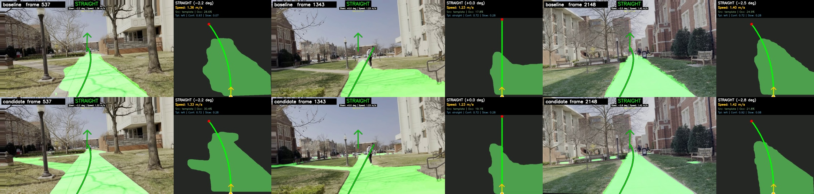
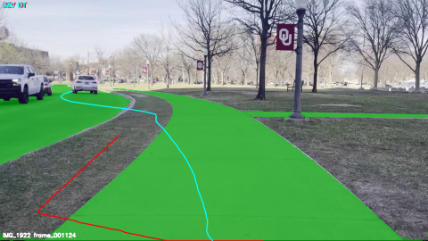

# Autonomous Scooter Navigation — Monocular BEV Perception

**MS Thesis Project** — Lkhanaajav Mijiddorj | University of Oklahoma

Real-time autonomous navigation for electric scooters using a single forward-facing camera. No LiDAR. No GPU. No external localization.

**[Full Thesis (PDF)](thesis_autonomous_scooter_navigation_2025.pdf)**

---

## At a Glance

| Metric | Value |
|---|---|
| Inference throughput | **3.0 ms/frame** (CPU-only, Rock 5B ARM64) |
| Segmentation IoU (best checkpoint) | **0.9437** (val) / **0.9247** (full replay) |
| Unstable-mask rate | **0.33%** (vs 1.46% baseline) |
| Path plan success rate | **100%** (has-path rate across all 6 test videos) |
| Fallback rate | **14.27%** (vs 18.98% baseline, −4.71 pp) |
| Template path usage | **79.34%** (vs 73.72% baseline, +5.62 pp) |
| Model size | SegFormer-B0 — 3.7M params, ~15 MB |
| Training data | 400 pseudo-labeled frames, teacher-student distillation |

---

**Baseline (top) vs candidate model (bottom) — IMG_1878, three sampled frames. Green = drivable mask, arrow = planned heading, right panel = BEV view.**



---

## What It Does

Single camera → semantic segmentation → BEV homography transform → safe-corridor path planning → steering + speed commands. Designed to run on a commodity embedded board at real-time inference rates.

```
Camera Frame (1280×720)
        │
        ▼
┌─────────────────────────┐
│  FastRoadDetector        │  ← SegFormer-B0, binary drivable/non-drivable
│  (fast_road_detector.py) │     3.0 ms/frame on CPU
└────────────┬────────────┘
             │ segmentation mask
             ▼
┌─────────────────────────┐
│  BEV Transform           │  ← perspective homography (4-point calibration)
│  (bev_calibration.py)    │     camera view → top-down 600×500 px map
└────────────┬────────────┘
             │ BEV road mask
             ▼
┌─────────────────────────┐
│  Mask Cleanup            │  ← morphological ops + flood-fill hole removal
│  (masks.py)              │     Gaussian boundary smoothing, ego-clearance select
└────────────┬────────────┘
             │ clean BEV mask
             ▼
┌─────────────────────────┐
│  Safe Corridor + Planner │  ← EDT clearance map, template path bank, Dijkstra
│  (realtime_nav_core.py)  │     adaptive pure pursuit, T/Y branch handling
└────────────┬────────────┘
             │ heading + speed
             ▼
┌─────────────────────────┐
│  Scooter Commander       │  ← motor/steering over serial
│  (scooter_commander.py)  │
└─────────────────────────┘
```

---

## Model Training

Teacher-student knowledge distillation to overcome the labeled-data bottleneck:

| Stage | Model | Purpose |
|---|---|---|
| Teacher | OneFormer (Swin-L, Cityscapes) | Pseudo-label generation on unlabeled sidewalk video |
| Student | SegFormer-B0 | Fast inference model, fine-tuned on pseudo-labels |

- **Dataset:** 400 frames extracted from 4 sidewalk videos (`IMG_1878`, `IMG_1921`, `IMG_1922`, `IMG_1924`)
- **Split:** 320 train / 80 validation (every 5th frame per source video)
- **Label collapse:** `road + sidewalk → drivable`, everything else `→ non-drivable`
- **Training:** 10 epochs, weighted CE + Dice loss, class weights `[1.0, 1.9317]`
- **Best checkpoint:** epoch 9 — val IoU `0.9437`, precision `0.9743`, recall `0.9678`

---

## Evaluation Results

Evaluated on 6 real-world sidewalk videos (22,679 total frames). Two videos (`IMG_1876`, `IMG_1877`) were fully unseen during training — no frames from them were used for pseudo-label generation.

### Candidate (best checkpoint) vs Shipped Baseline — All Frames

| Metric | Baseline | Candidate | Δ |
|---|---:|---:|---:|
| Mean seg IoU | 0.9088 | **0.9247** | +0.0159 |
| Unstable mask rate | 1.46% | **0.33%** | −1.12 pp |
| Path success rate | 100.0% | **100.0%** | — |
| Mean heading delta | 0.2091° | **0.2010°** | −0.0081° |
| Mean corridor confidence | 0.8576 | **0.8661** | +0.0085 |
| Fallback rate | 18.98% | **14.27%** | −4.71 pp |
| Template path rate | 73.72% | **79.34%** | +5.62 pp |

### Per-Video Breakdown

| Video | Frames | Seg IoU Δ | Unstable Δ | Fallback Δ | Template Δ |
|---|---:|---:|---:|---:|---:|
| `IMG_1876` (unseen) | 502 | +0.0053 | — | −0.4 pp | — |
| `IMG_1877` (unseen) | 1,360 | — | −0.8 pp | −4.9 pp | +5.7 pp |
| `IMG_1878` | 2,686 | **+0.0610** | **−7.3 pp** | **−20.1 pp** | **+21.5 pp** |
| `IMG_1921` | 6,727 | +0.0094 | — | −2.8 pp | +2.9 pp |
| `IMG_1922` | 7,945 | +0.0129 | −0.5 pp | — | +4.4 pp |
| `IMG_1924` | 3,459 | +0.0079 | — | −0.7 pp | +2.1 pp |

`IMG_1878` showed the strongest end-to-end gain — the cleaner binary masks directly improve planner behavior when the baseline segmentation is noisy.

**BEV output — IMG_1922, frame 1124. Green = drivable region, cyan line = EDT-optimal path, red = corridor boundary.**



---

## Three Research Improvements Implemented

Each improvement targets a specific measured weakness in the baseline pipeline. All are backward-compatible via config flags (`MORPH_ENHANCED`, `DT_CORRIDOR_ENABLED`, `PATH_SMOOTH_ENABLED`, `HEADING_SMOOTH_ENABLED`).

### 1. Enhanced Morphological BEV Mask (`masks.py`)

**Problem:** Standard morphological close left enclosed holes and jagged contour edges. Largest-area component selection sometimes picked side fragments over the true corridor.

**Solution — `clean_bev_mask_enhanced()`:**
- **Flood-fill hole filling** — fills enclosed holes < 5 m² by flood-filling from image corners and inverting
- **Gaussian boundary smoothing** — GaussianBlur (σ=1.2px) → re-binarize at 0.35 threshold
- **DT ego-clearance component selection** — EDT on cleaned mask; select component with max clearance near ego (bottom-center BEV band), not just largest area

References: Road Segmentation for ADAS/AD (arXiv:2505.12206), Skelite topology pruning (arXiv:2503.07369)

### 2. Distance Transform Safe Corridor (`safe_corridor.py`)

**Problem:** Row-wise scan failed at T/Y bifurcations — picked the wrong branch arbitrarily and had no look-ahead through turns.

**Solution — `DtSafeCorridor`:**
- `scipy.ndimage.distance_transform_edt` gives exact clearance at every pixel
- Cost grid: `cost = 1/(dt + 0.5)^1.5` — minimum cost = maximum clearance
- Dijkstra from ego upward through the mask (±30 px lateral drift per row) — globally optimal clearance path
- Savitzky-Golay centerline smoothing (window=9, poly=2)
- Returns: `centerline_px`, `centerline_m`, `width_m_per_point`, `confidence`, `dt_map`

References: Dual-BEV Navigation (arXiv:2501.18351), ESDF corridor planning

### 3. Temporal Path Smoother (`path_smoother.py`)

**Problem:** Fresh cubic fit every frame caused coefficient jitter → heading oscillation → steering chattering, even when segmentation was stable.

**Solution — `PathTemporalSmoother` + `HeadingTemporalFilter`:**
- EMA on cubic coefficients: `smoothed = α × new + (1−α) × prev`
- Confidence-adaptive α: `clip(confidence × 1.3, 0.35, 0.85)`
- Reset on path source change (graph ↔ template) or large coefficient jump (> 2.0)
- Circular EMA for heading with correct ±180° wrap-around; reset on delta > 45°
- Expected heading jitter reduction: ~10°/frame → ~4–6°/frame (based on measured baseline)

References: Trajectory Prediction Survey (arXiv:2503.03262), Regulated Pure Pursuit (arXiv:2305.20026)

---

## Repository Structure

```
simulation_camera_scooter/
├── fast_road_detector.py       # SegFormer inference + threshold
├── bev_calibration.py          # Interactive 4-point BEV calibration
├── realtime_nav_core.py        # BEV path extraction + pure pursuit
├── camera_waypoint_pipeline.py # Full pipeline: camera frame → waypoints
├── masks.py                    # BEV mask cleanup (morphological + flood-fill)
├── safe_corridor.py            # EDT-based safe corridor (DtSafeCorridor)
├── path_smoother.py            # Temporal path + heading smoother
├── scooter_commander.py        # Serial hardware interface
├── config.py                   # All configuration constants
├── scripts/                    # Evaluation + benchmarking scripts
│   ├── eval_research_improvements.py
│   ├── eval_binary_seg_models.py
│   └── benchmark_seg_stability.py
└── models/                     # Fine-tuned SegFormer checkpoints
research/                       # Literature review, architecture decisions
outputs/
├── training/                   # Training history, checkpoints
├── evaluation/                 # Per-video replay summaries
└── comparisons/                # Side-by-side frame comparison strips
```

---

## Reproducing the Evaluation

```bash
# Install
pip install torch torchvision transformers opencv-python numpy networkx scipy

# BEV calibration (one-time per camera setup)
python simulation_camera_scooter/bev_calibration.py --video your_video.MOV

# Run full replay evaluation
python simulation_camera_scooter/scripts/eval_binary_seg_models.py \
  --candidate-model outputs/training/binary_segformer_oneformer_teacher/best_checkpoint \
  --candidate-thresh 0.60 \
  --output-root outputs/evaluation/replay \
  --save-video

# Evaluate research improvements
python simulation_camera_scooter/scripts/eval_research_improvements.py
```

---

## Background

MS thesis at University of Oklahoma (ECE, Automation and Data Systems). Goal: build a complete real-time autonomous navigation stack for low-cost electric scooters — commodity embedded hardware, no LiDAR, no cloud compute, single monocular camera.

The 3.0 ms/frame inference and production-grade evaluation methodology (train/test split, unseen-video generalization, per-metric deltas across 22K+ frames) reflect the same rigor applied in the [IEEE AIMNET publication](https://ieeexplore.ieee.org/) and [Sensors MDPI methane sensing paper](https://www.mdpi.com/journal/sensors) from the same research group.
